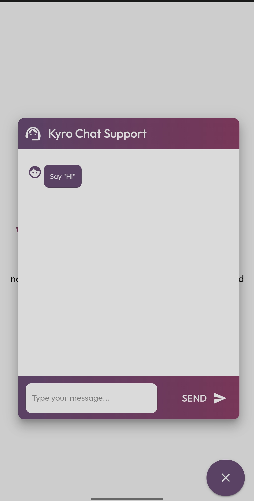

# University Chatbot



University Chatbot is a web application that utilizes Google's Dialogflow API for natural language processing to handle user queries and generate responses.
This project consists of a backend server built with Express.js and a frontend user interface built with React and Material-UI.

## Table of Contents

- [Features](#features)
- [Prerequisites](#prerequisites)
- [Installation](#installation)
- [Getting Started](#getting-started)
- [API Endpoint](#api-endpoint)
- [Contributing](#contributing)


## Features

- Chat with a virtual assistant powered by Dialogflow.
- Send and receive messages in real-time.
- Like or dislike responses from the chatbot.

## Prerequisites

Before running the application, make sure you have the following installed on your system:

- Node.js
- Google Cloud account with Dialogflow API credentials

## Installation

1. Clone the repository:

    In Git-Bash:
   ```
    $ git clone https://github.com/your-username/university-chatbot.git
    $ cd university-chatbot
   ``` 
3. Install frontend dependencies:
   
    In Git-Bash:
   ```
    $ cd ../Your respective Folder Name
    $ npm install
   ```
4. Install backend dependencies:

   In Git-Bash:
   ```
    $ cd ../Your respective Folder Name
    $ npm init
    
   
## Getting Started
   
  1)Set up Dialogflow:
  
 * Create a Dialogflow agent in your Google Cloud account.
 * Select or create a Cloud Platform project.
 * Enable the Dialogflow API API.
 * Set up authentication with a service account so you can access the API from your local workstation.
 * Download the service account key JSON file and save it as key.json in the backend folder.
      
  2)Create the backend server:
  
 - Installing the client library:
        ```
        npm install @google-cloud/dialogflow
        ```
- Using the client library:
    
 ```
const express = require("express");
const app = express();
const dialogflow = require("@google-cloud/dialogflow");
const uuid = require("uuid");
const Path = require("path");
const cors = require("cors");

app.use(express.json());
app.use(cors());

app.post("/api/chatbot", async (req, res) => {
  const { inputText } = req.body;
  console.log(inputText);

  try {
    const responseText = await runSample(
      (projectId = "your-project-id"),
      inputText
    );
    res.send(responseText);
  } catch (error) {
    console.error("Error processing user input:", error);
    res.status(500).send("Error processing user input");
  }
});

async function runSample(projectId, inputText) {
  const sessionId = uuid.v4();

  const sessionClient = new dialogflow.SessionsClient({
    keyFilename: Path.join(__dirname + "/key.json"),
  });
  const sessionPath = sessionClient.projectAgentSessionPath(
    projectId,
    sessionId
  );

  const request = {
    session: sessionPath,
    queryInput: {
      text: {
        // The query to send to the dialogflow agent
        text: inputText,

        languageCode: "en-US",
      },
    },
  };

  const responses = await sessionClient.detectIntent(request);
  // console.log("Detected intent");
  const result = responses[0].queryResult;
  // console.log(`  Query: ${result.queryText}`);
  // console.log(`  Response: ${result.fulfillmentText}`);
  if (result.intent) {
    // console.log(`  Intent: ${result.intent.displayName}`);
  } else {
    // console.log("  No intent matched.");
  }
  // console.log(result.fulfillmentText);
  return result.fulfillmentText;
}

const PORT = process.env.PORT || 3001;

app.listen(PORT, () => {
  console.log(`Server is running in port ${PORT}`);
});

 ```
        
  - In Git-Bash:
    
    ```
     $ npm start
    ```
     * You can change the port by setting the PORT environment variable.

  3)Run the frontend app:
  
 - In Git-Bash:
   
     ```
        $ cd ../Your respective Folder Name
        $ npm start
     ```
      * The React app will run on port 3000 by default.

  4)Access the application:
  
* Open your web browser
* And navigate to http://localhost:3000 to access the University Chatbot application.

 ## API Endpoint
 
  POST http://localhost:3000/api/chatbot:
  
  Send a POST request to the root endpoint with the following JSON payload:
 ```
      {
        "inputText": "User's query text goes here"
      }
```
  The server will process the user's query using Dialogflow and return the chatbot's response as JSON.

 ## Contributing
 
  Contributions to the University Chatbot project are welcome! 
  If you find any issues or want to suggest improvements, please feel free to open an issue or submit a pull request.

Feel free to chat with the University Chatbot and have a great time exploring the application!
For more information about the code, check the source files in the backend and frontend folders.
